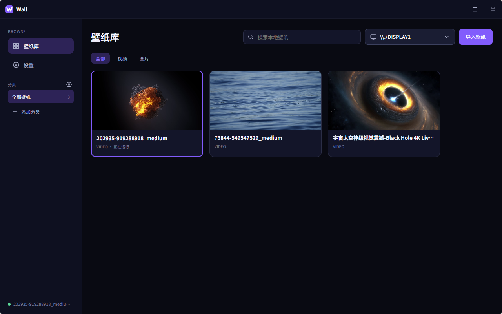

<!-- Wall user guide, development entry point, and open-source overview. -->

<p align="right">
    English | <a href="README.zh-CN.md">简体中文</a>
</p>

<p align="center">
    
</p>

# Wall

Wall is a free, open-source dynamic wallpaper app for Windows 10/11 x64. It only reads local videos and images
selected by the user and provides no accounts, marketplace, cloud sync, telemetry, or automatic updates.

<p align="center">
    
</p>

## Features

- Local video and image wallpapers with user categories and batch management.
- Cover, Contain, and Stretch scaling, common aspect ratios, three anti-aliasing levels, and source/24/30/60 FPS.
- Per-wallpaper overrides with global inheritance, mpv hardware decoding, looping, mute, and volume controls.
- Independent, cloned, and spanned multi-display playback with per-target tray controls.
- Automatic pause for fullscreen or maximized apps, battery power, and display sleep.
- System tray controls, launch at startup, close to tray, display hot-plug retention, and session restore.
- Fully offline runtime; the [project homepage](https://github.com/NiceBlueChai/wall) is only handed to the system
  browser after an explicit user action.

## Download and Use

1. Download `Wall-v1.0.0-windows-x64-portable.zip` from GitHub Releases.
2. Extract the complete directory; do not copy `Wall.exe` by itself.
3. Run `Wall.exe`, then select **Import Wallpaper** to choose a local video or image.
4. The `Sample Wallpapers` directory contains three test videos generated by the project build script.

The portable package does not bundle a fixed WebView2 runtime. Windows 10/11 normally includes it; install the
Microsoft Edge WebView2 Runtime if it is missing. The app and wallpaper playback do not require a network connection.

## Supported Scope

- Operating systems: Windows 10/11 x64.
- Media: local MP4, WebM, MKV, MOV, AVI, JPG, JPEG, PNG, WebP, BMP, and GIF files.
- Displays: primary or secondary displays in independent, cloned, or spanned layouts.
- Not supported: online marketplace, web or interactive wallpapers, playlists, and scheduled rotation.

## Privacy and Data

- Wall does not upload media, modify source files, or send telemetry.
- The library, settings, and playback session are stored in the current user's application data directory.
- Runtime logs are stored in the current user's application configuration directory and can be opened from Settings.
- The runtime performs no update checks or HTTP requests.

## Development

Requirements: Node.js 22, Rust stable, Microsoft C++ Build Tools, WebView2 Runtime, and 7-Zip.

```powershell
npm install
powershell -ExecutionPolicy Bypass -File scripts\prepare-mpv.ps1
npm run tauri dev
```

## Test and Build

```powershell
npm run test
cargo test --manifest-path src-tauri\Cargo.toml
npm run build
```

Building the portable package with its three project-owned sample videos also requires `ffmpeg` on `PATH`:

```powershell
powershell -ExecutionPolicy Bypass -File scripts\package-portable.ps1
```

The no-mouse native smoke test starts the portable build, verifies the WorkerW hierarchy and GUI subsystem, and then
restores the original application data by SHA-256:

```powershell
powershell -ExecutionPolicy Bypass -File scripts\verify-portable.ps1 `
    -WallDirectory release\Wall-v1.0.0-windows-x64-portable `
    -VideoPath C:\path\to\test.mp4
```

To exercise the saved-session startup path, keep the existing application data and point `VideoPath` to the media
being restored by the active session:

```powershell
powershell -ExecutionPolicy Bypass -File scripts\verify-portable.ps1 `
    -WallDirectory release\Wall-v1.0.0-windows-x64-portable `
    -VideoPath C:\path\to\active-wallpaper.mp4 `
    -UseExistingData
```

If verification is interrupted, the script preserves the original data backup and refuses another normal run. Close
all Wall processes, then recover it with:

```powershell
powershell -ExecutionPolicy Bypass -File scripts\verify-portable.ps1 `
    -WallDirectory release\Wall-v1.0.0-windows-x64-portable `
    -RecoverInterruptedRun
```

## Project Structure

| Path                   | Responsibility                                                                |
| ---------------------- | ----------------------------------------------------------------------------- |
| `src/`                 | Vue 3 UI, routing, state, and Tauri calls                                     |
| `src-tauri/src/`       | Windows integration, WorkerW, mpv, tray, storage, and system monitoring       |
| `scripts/`             | mpv preparation, sample generation, portable packaging, and host verification |
| `docs/design/`         | Product scope, UI, and visual specification                                   |
| `docs/implementation/` | Product contracts, implementation boundaries, and verification evidence       |

## Documentation and Contributions

- [Design specification (Chinese)](docs/design/wall-v1-design-spec.md)
- [Product contract and implementation report (Chinese)](docs/implementation/wall-v1-contract-report.md)
- [Contributing guide (Chinese)](CONTRIBUTING.md)
- [Security policy (Chinese)](SECURITY.md)
- [Changelog](CHANGELOG.md)

Issues and pull requests are welcome. AI-assisted development is allowed, but contributors must review the final
changes, run the tests, and take responsibility for licensing.

## License and Author

Wall source code and project-generated sample media are licensed under the MIT License. The bundled mpv runtime uses
its own licenses; see `THIRD_PARTY_NOTICES.md`.

- Author: NiceBlueChai
- Contact: bluechai@qq.com
